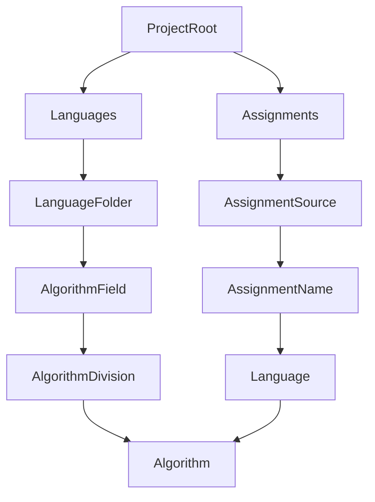

# Algorithm Collection Across Languages
This Algorithm collection contains (almost) all of the algorithms i have made so far.

The algorithms listed ranges in complexity widely.
> Complexity level ranges from very simple to not so simple for now. However, this could be subject to change at any moment.

This project aims to be a place where you can just look into for any algorithm you would ever need. As an effect, This project also serves as a motivation source for me to do more problem solving A.K.A implement more algorithms.

### Project Structure

- For example, a string splitting algorithm for javascript might be found in 'Languages/javascript/string.js' where javascript is the language, and string is the AlgorithmDivision. Although this could be changed as the project grows, if at a point, an AlgorithmField file became too big, it could instead be seperated into smaller pieces of code and be put inside the AlgorithmField folder with each file representing a smaller division of the field or the group of algorithm itself.
- For assignment categorization, Language and AssignmentName are interchangeable, adjust accordingly to the size of a single assignment.
